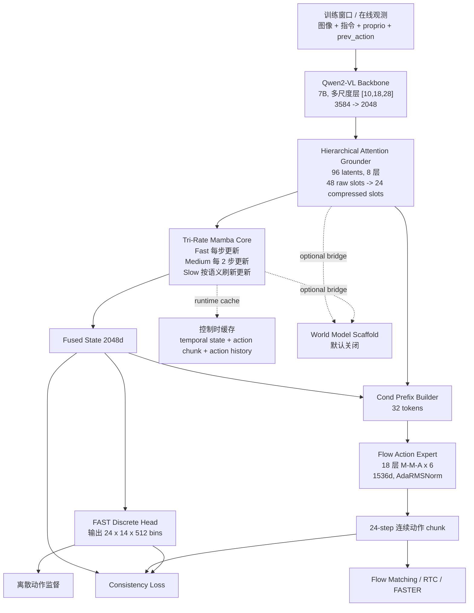
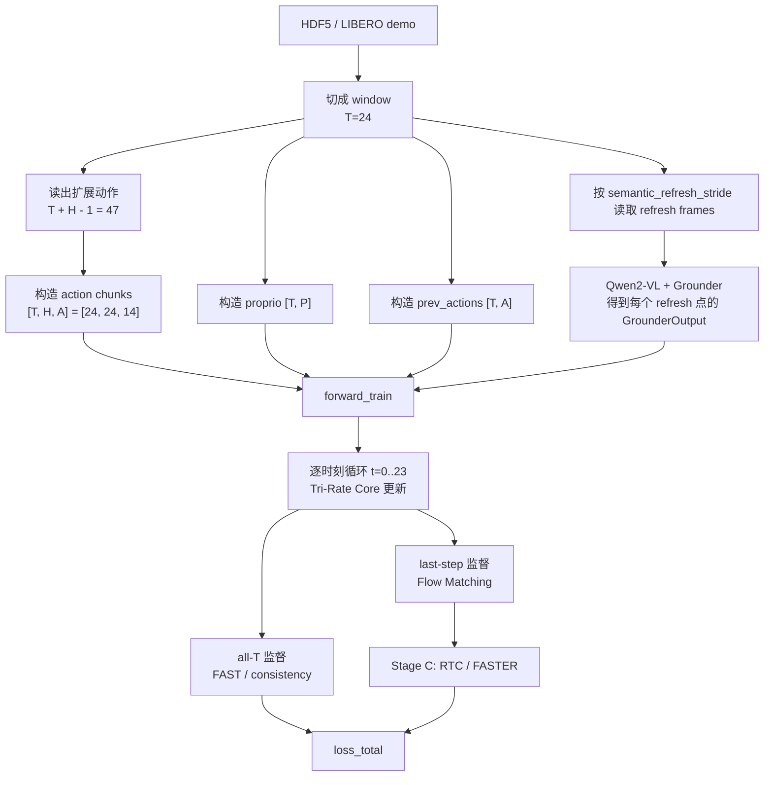
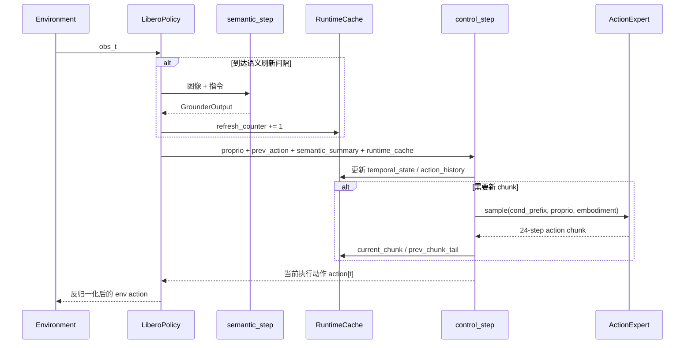

# HybridVLA v2 架构分析报告 v0.10

## 1. 分析范围

本报告以当前仓库代码为准，而不是以 README 或历史分析文档为准。核心依据主要来自以下实现：

- `vla_hybrid_v2/models/hybrid_vla_v2.py`
- `vla_hybrid_v2/models/qwen2vl_backbone.py`
- `vla_hybrid_v2/models/attention_grounder.py`
- `vla_hybrid_v2/models/mamba_core.py`
- `vla_hybrid_v2/models/flow_action_expert.py`
- `vla_hybrid_v2/world_model/*`
- `scripts/train_unified.py`
- `vla_hybrid_v2/data/*`
- `vla_hybrid_v2/infer/libero_policy.py`

## 2. 一句话结论

当前代码实现的是一条非常清晰的主干：

`多模态语义编码(Qwen2-VL) -> 结构化语义压缩(Grounder) -> 三速率时序建模(Tri-Rate Mamba) -> 双动作头(FAST 离散 + Flow 连续) -> 分块执行(Receding Horizon Control)`

其中：

- 真正进入训练与推理主回路的是 `backbone + grounder + temporal core + action heads`
- `world_model` 已接入模型对象，但默认关闭，且没有进入主训练/推理路径
- 训练和推理都围绕 “语义低频刷新、动作高频执行” 这条主线展开

## 3. 总体架构图

## 4. 模型主线的分层理解

### 4.1 感知层：Backbone

文件：`vla_hybrid_v2/models/qwen2vl_backbone.py`

职责：

- 使用 `Qwen/Qwen2-VL-7B-Instruct` 作为视觉语言 backbone
- 提取多尺度隐状态 `layers=[10,18,28]`
- 通过 `MultiScaleAdapter` 将 3584 维特征投影并融合到 2048 维
- 在多相机模式下，为视觉 token 增加 camera embedding
- 用 LoRA 微调 text backbone，同时冻结 vision tower 和前 16 层文本层

关键点：

- backbone 的输出不是直接拿最后一层，而是从多个层取 hidden states 再做 gated fusion
- 这一步输出的统一语义特征形状是 `[B, N, 2048]`
- multi-camera 不是单独的 camera encoder，而是复用 Qwen2-VL 的多图输入能力，再追加 camera position embedding

### 4.2 语义结构化层：Grounder

文件：`vla_hybrid_v2/models/attention_grounder.py`

职责：

- 把 backbone 的 token 序列压缩成少量结构化 latent token
- 从“稠密 token 序列”变成“可解释的结构化槽位表示”

latent 布局：

- `global(1)`
- `objects(48)`
- `phase(1)`
- `uncertainty(1)`
- `affordance(1)`
- `aux(44)`
- 合计 `96` 个 latent

中间压缩：

- 前 4 层：96 个 latent 全量与 backbone 特征交互
- 第 4 层后：把 48 个 raw object slots 压缩成 24 个 compressed slots
- 后 4 层：在压缩后的 latent 集合上继续 refine

Grounder 最终对外输出：

- `global_token: [B, 2048]`
- `compressed_object_slots: [B, 24, 2048]`
- `phase_token: [B, 2048]`
- `uncertainty_token: [B, 2048]`
- `affordance_token: [B, 2048]`

这一步的本质，是把 VLM 的“长序列 token 空间”转成更适合控制的“结构化任务状态”。

### 4.3 时序层：Tri-Rate Mamba Core

文件：`vla_hybrid_v2/models/mamba_core.py`

职责：

- 在不同时间尺度上建模控制动态
- 把静态语义、当前 proprio、前一动作、动作历史、刷新陈旧度等统一进时序状态

输入 token 组成：

- `global_token`
- `phase_token`
- `uncertainty_token`
- `affordance_token`
- `proprio_token`
- `prev_action_token`
- `stale_token`
- `embodiment_token`
- `action_history_token`
- `compressed_object_slots(24)`

因此，Temporal Core 实际输入序列长度是：

- `9 + 24 = 33` 个 token

三条流：

- `FastMamba`: 20 层，`d_state=128`，每个 control step 都更新
- `MediumMamba`: 6 层，`d_state=128`，默认每 2 步更新一次
- `SlowMamba`: 10 层，`d_state=256`，只在 semantic refresh 时更新

输出机制：

- 每条流都对整个 token 序列做处理
- 最后对序列做 `mean pooling` 得到 `fast_token / medium_token / slow_token`
- 三个 token 再通过 `CrossAttentionFusion` 融合成 `fused_state`

`fused_state` 是整个控制决策最关键的统一时序表征，形状为 `[B, 2048]`。

### 4.4 动作解码层：双头设计

#### A. FAST 离散动作头

文件：`vla_hybrid_v2/models/discrete_heads.py`

职责：

- 从 `fused_state` 一次性预测完整 `24-step` 动作 chunk
- 对每个 future step、每个 action dim 输出 512 个离散 bin

输出形状：

- `[B, H, A, V] = [B, 24, 14, 512]`

特点：

- 推理快
- 结构简单
- 适合作为稠密监督信号
- 但动作是量化的，不是最终最高精度路径

#### B. Flow 连续动作专家

文件：`vla_hybrid_v2/models/flow_action_expert.py`

职责：

- 在 flow matching 框架下生成连续动作 chunk
- 输入 noisy action chunk，预测 velocity
- 采样时通过 Euler / Midpoint ODE 积分恢复动作

结构：

- `18` 层
- 模式固定为 `M-M-A` 重复 6 次
- hidden dim = `1536`
- 使用 `AdaRMSNorm` 由 flow timestep 条件化

输入序列：

- `proprio token(1)`
- `embodiment token(1)`
- `action tokens(24)`

因此 expert 的主序列长度是：

- `2 + 24 = 26`

条件前缀 `cond_prefix`：

- `global(1)`
- `compressed_object_slots(24)`
- `phase(1)`
- `uncertainty(1)`
- `affordance(1)`
- `fused_state(1)`
- `fast_token(1)`
- `medium_token(1)`
- `slow_token(1)`

合计：

- `32` 个条件 token

注意这里有一个非常关键的代码级细节：

- `Temporal Core` 的输入长度是 `33`
- `Action Expert` 的条件前缀长度是 `32`

因为 expert 不直接吃 `proprio / prev_action / stale / action_history` 这些 token 序列，而是单独吃 `proprio_token + embodiment_token + noisy_actions`，同时通过 `cond_prefix` 接收语义与时序摘要。

## 5. 训练数据流

### 5.1 数据窗口构造

文件：

- `vla_hybrid_v2/data/hdf5_adapter.py`
- `vla_hybrid_v2/data/libero_hdf5_adapter.py`

训练样本不是单步，而是一个固定窗口：

- `T = sequence_window = 24`
- `H = chunk_horizon = 24`

为保证窗口内每个时刻都能拿到完整未来 chunk，adapter 实际读取：

- `T + H - 1 = 47` 个动作

然后为每个时刻 `t` 构造：

- `actions[t] = raw_actions[t : t+H]`

所以模型训练时看到的是：

- `actions: [B, 24, 24, 14]`
- `proprio: [B, 24, P]`
- `prev_actions: [B, 24, 14]`

### 5.2 语义刷新

训练里默认：

- `semantic_refresh_stride = 6`
- 所以 24 步窗口内 refresh 点是 `t = [0, 6, 12, 18]`

`forward_train()` 会：

- 若 batch 提供 `refresh_input_ids / refresh_pixel_values_list`，则每个 refresh 点都重新跑一次 `backbone + grounder`
- 否则只跑一次 semantic encoder，并在整个窗口里复用

随后通过 `refresh_map` 把每个时刻 `t` 映射到最近一次 refresh 产生的 `GrounderOutput`。

### 5.3 逐时刻时序循环

在 `forward_train()` 中，每个 `t` 都会做：

1. 投影当前 `proprio[t]`
2. 投影当前 `prev_actions[t]`
3. 从 `ActionHistoryBuffer` 编码最近 8 步动作历史
4. 计算 stale token
5. 取出当前时刻应使用的 `grounder_out`
6. 送入 Tri-Rate Mamba Core
7. 得到 `fused_state / fast_token / medium_token / slow_token`

最终得到：

- `fused_states: [B, T, 2048]`
- `fast_tokens: [B, T, 2048]`

### 5.4 多头损失是怎么挂上的

#### FAST 离散损失

- 对所有 `T` 个时刻都监督
- 输入是 `fused_states[t]`
- 目标是 `actions[t]` 离散化后的 `24-step` chunk

#### Phase / Affordance 损失

- 也按所有 `T` 个时刻计算
- 但它们不是基于 temporal fused state，而是基于当前 refresh 对应的 `grounder_out.phase_token / affordance_token`

#### Flow Matching 损失

- 只在最后一个时刻 `t = T-1` 计算
- 目标是最后一个窗口状态对应的未来 `24-step` 连续动作 chunk

原因很直接：

- FAST 头便宜，可以做 all-T 监督
- Flow expert 成本高，所以当前实现只做 last-step 监督

### 5.5 Stage A / B / C 的训练职责分离

| Stage | 主要训练对象 | 关键机制 |
| --- | --- | --- |
| A | Backbone LoRA + Grounder + Tri-Rate Core + FAST/结构化头 | 先把感知和时序语义学稳，expert 冻结 |
| B | 再加入 Flow Expert | `cond_prefix.detach()`，阻断 flow matching 反向污染 backbone |
| C | 全局微调 | 打开 RTC 与 FASTER，允许端到端联合修正 |

更细的实现细节：

- backbone 参数组学习率会乘 `0.1`
- action expert 参数组学习率会乘 `0.5`
- EMA 从 Stage B 开始真正有意义

## 6. 推理与闭环控制数据流

### 6.1 推理被拆成两步

文件：

- `HybridVLAv2.semantic_step()`
- `HybridVLAv2.control_step()`
- `vla_hybrid_v2/infer/libero_policy.py`

推理不是一次前向完成，而是显式拆成：

1. `semantic_step`
2. `control_step`

这样做的原因是：

- 语义刷新频率低，不需要每步都重新编码图像与语言
- 控制频率高，需要每步更新 proprio、动作历史和 recurrent state

### 6.2 RuntimeCache 里存什么

`RuntimeCache` 主要持有：

- `temporal_state`
- `last_semantic`
- `refresh_counter`
- `current_chunk`
- `chunk_step`
- `action_history`
- `prev_chunk_tail`（RTC 推理重叠混合）

这说明 inference 不是无状态前向，而是标准的 stateful policy。

### 6.3 Chunked control 的真实执行方式

推理时 action expert 会生成完整 chunk：

- `[B, 24, 14]`

但真正执行的只有前：

- `execution_horizon = 8`

也就是说这是标准的 receding-horizon control：

- 先预测长 horizon
- 只执行前 8 步
- 然后基于新状态重新规划

Stage C 的 `RTC`，就是为这个“相邻 chunk 的重叠边界”服务的。

## 7. 核心模块作用总表

| 模块 | 代码文件 | 主要输入 | 主要输出 | 核心作用 |
| --- | --- | --- | --- | --- |
| Qwen2VLBackboneWrapper | `models/qwen2vl_backbone.py` | 文本 token、图像 patch | `[B,N,2048]` | 提供统一视觉语言 token 特征 |
| HierarchicalAttentionGrounder | `models/attention_grounder.py` | `[B,N,2048]` | global、24 object slots、phase、uncertainty、affordance | 把稠密 token 转成结构化任务状态 |
| ActionHistoryEncoder | `models/mamba_core.py` | 最近 8 步动作 | `[B,2048]` | 给 temporal core 提供动作短历史摘要 |
| TriRateMambaCore | `models/mamba_core.py` | grounder token + proprio + prev_action + stale + embodiment + history | `fused_state + three stream tokens` | 建模多时间尺度控制动态 |
| FASTDiscreteHead | `models/discrete_heads.py` | `fused_state` | `[B,24,14,512]` | 快速、稠密、全时刻监督的离散动作头 |
| FlowActionExpert | `models/flow_action_expert.py` | noisy action chunk + cond_prefix + proprio + embodiment | `[B,24,14] velocity` | 高精度连续动作生成 |
| V2ConsistencyLoss | `losses/consistency_loss.py` | fused states、fast/slow、离散/连续动作 | 标量 loss | 保证时序一致性与双头一致性 |
| ImaginationEngine | `world_model/imagination_engine.py` | `z_det` + policy action | imagined trajectory | 可选世界模型，当前默认不进主回路 |

## 8. 世界模型分支的真实地位

世界模型相关文件：

- `world_model/imagination_engine.py`
- `world_model/imagination_mamba.py`
- `world_model/stochastic_state.py`
- `world_model/object_physics.py`
- `world_model/world_model_heads.py`
- `world_model/visual_decoder.py`
- `world_model/subgoal_planner.py`

这部分代码并不是空壳，里面有完整设计：

- `StochasticStateModule`: DreamerV3 风格离散随机 latent
- `ImaginationMamba`: 8 层 latent dynamics
- `ObjectPhysicsEngine`: 6 层 attention-GNN，对 object slot 做交互建模
- `WorldModelHeads`: reward / value / done
- `CNNWorldDecoder`: 112x112 图像重建
- `LatentSubgoalPlanner`: 预测 phase 结束时的 latent subgoal

但需要非常明确地说：

- 默认配置 `world_model.enable = false`
- `forward_train()` 没有调用 imagination rollout
- `control_step()` 也没有调用 world model
- 当前主系统只保留了 `get_world_model_state()` 这个桥接接口

因此，world model 在 v0.10 里更准确的定位是：

- “已设计、已编码、未并入主训练闭环”的旁路分支

## 9. 关键张量与调度

### 9.1 关键张量

| 名称 | 形状 | 含义 |
| --- | --- | --- |
| `backbone_hidden` | `[B,N,2048]` | 多尺度融合后的视觉语言 token |
| `compressed_object_slots` | `[B,24,2048]` | 压缩后的对象级语义槽位 |
| `input_seq` | `[B,33,2048]` | temporal core 输入序列 |
| `fused_state` | `[B,2048]` | 三速率融合后的统一控制状态 |
| `cond_prefix` | `[B,32,1536]` | action expert 的条件前缀 |
| `noisy_actions` | `[B,24,14]` | flow expert 的噪声动作轨迹 |
| `velocity` | `[B,24,14]` | flow matching 预测的速度场 |
| `current_chunk` | `[B,24,14]` | 推理时缓存的动作 chunk |

### 9.2 时间调度

训练默认：

- fast: 每步更新
- medium: 每 2 步更新
- slow/semantic refresh: 每 6 步刷新一次

推理默认：

- `control_hz = 50`
- `medium_hz = 25`，对应每 2 步更新
- `semantic_hz = 12.5`，对应每 4 步刷新

这意味着代码里存在一个很重要的实现差异：

- 训练默认节奏是 `1 : 2 : 6`
- 推理默认节奏是 `1 : 2 : 4`

如果不特别改配置，train/infer 的 slow 语义刷新频率并不完全一致。

## 10. 架构上的强点

### 10.1 语义和控制解耦得比较干净

- semantic encoder 被显式拆成 backbone + grounder
- temporal core 只处理结构化语义与控制相关 token
- action expert 只在 Stage B/C 进入

这使得模型具备清晰的模块边界。

### 10.2 三速率时序建模是当前架构的主创新点

- 不是单 stream Mamba
- 也不是简单的快慢双流
- 而是 fast / medium / slow 三条时间尺度并行存在

对机器人操作这类“高频动作、低频语义、中频轨迹形状”的任务是合理的。

### 10.3 动作输出使用双头，监督密度和精度兼顾

- FAST 头提供 cheap 且稠密的 all-T 监督
- Flow expert 提供更高精度的连续动作 chunk
- consistency loss 负责把两条动作路径拉到一个共享动作语义空间

### 10.4 推理路径是工程上可落地的

- 有 runtime cache
- 有 action chunk 缓存
- 有 receding-horizon 执行
- 有 overlap blending

这不是只适合离线训练的 paper 架构，而是明确考虑了闭环 rollout。

## 11. 当前实现中的关键注意点

### 11.1 世界模型目前不是主系统的一部分

虽然代码量不少，但在 v0.10 主流程里：

- 不参与训练 loss
- 不参与 control
- 只保留了 bridge interface

所以不能把当前系统理解成“VLA + 已启用 world model”，更准确的说法是“VLA 主干 + world model scaffold”。

### 11.2 一些结构化头在真实数据管线里可能拿不到监督

当前真实 adapter：

- `HDF5DatasetAdapter`
- `LiberoHDF5DatasetAdapter`

都没有生成：

- `phase_labels`
- `affordance_labels`
- `step_weights`
- `semantic_refresh_steps`

这带来的直接结果是：

- phase head / affordance head 虽然在模型里，但在真实 HDF5 / LIBERO 数据上通常没有直接监督
- FASTER 的按步权重机制默认也拿不到外部 `step_weights`
- `semantic_refresh_steps` 也是由模型使用默认 stride 推导

所以当前真实训练的主监督更偏向：

- FAST 离散头
- Flow Matching
- Consistency

### 11.3 配置项和真实实现并非完全一一对应

有几处需要特别说明：

- `fusion_type` 配置存在，但当前 `TriRateMambaCore` 实际固定使用 `CrossAttentionFusion`
- `action_expert.ada_rmsnorm` 配置存在，但当前 expert 实现固定使用 AdaRMSNorm
- `action_expert.cond_dim` 在 `HybridVLAv2` 组网时被实际投影逻辑覆盖，最终 expert 看到的是 `d_model=1536`

因此，配置文件里某些字段更像“声明性保留位”，不是完全可切换实现。

### 11.4 多相机训练与推理支持不完全对称

- 训练配置默认的 `multi_camera.num_cameras = 3`
- 但 `HybridVLALiberoPolicy` 当前只支持 2 个推理相机：`agentview + eye_in_hand`

也就是说：

- 训练侧多相机设计更泛化
- LIBERO 推理封装当前更保守

## 12. 最终判断

从代码实现看，HybridVLA v2 的主系统已经非常明确：

1. `Qwen2-VL` 负责重感知与语言对齐
2. `Grounder` 负责把 VLM token 压成结构化任务状态
3. `Tri-Rate Mamba Core` 负责多时间尺度时序建模
4. `FAST + Flow Expert` 负责双路径动作解码
5. `Chunk Cache + RTC` 负责让闭环控制可执行

如果只看已真正跑通的主干，这是一套：

- 结构清晰
- 模块边界明确
- 训练阶段分工合理
- 面向闭环控制设计

的 VLA 架构。

如果把 world model 也算进去，那么更准确的说法应当是：

- 当前仓库已经具备“向 VLA + latent world model 演进”的接口和子模块
- 但 v0.10 的实际产品态仍然是“以 tri-rate VLA 为核心、world model 尚未并入主环”的版本

## 13. 建议的后续演进方向

如果后续要继续做 v0.11+ 级别演进，最值得优先统一的有四件事：

1. 对齐 train / infer 的 semantic refresh 频率，避免 `stride=6` 和 `12.5Hz -> stride=4` 的分叉。
2. 给真实数据 adapter 补齐 `phase_labels / affordance_labels / step_weights`，否则结构化头的大部分价值落不下来。
3. 把 `world_model` 真正接入训练 loop，否则它现在更像未来分支而不是当前系统能力。
4. 清理或兑现 `fusion_type / ada_rmsnorm / cond_dim` 这类“配置存在但行为固定”的开关。
